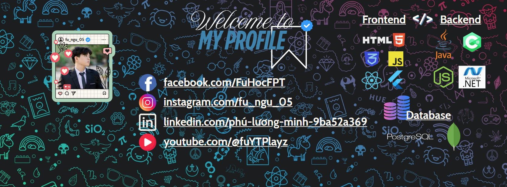

  

      
<!--      -->
      <h2 align="center"> こんにちは～👋 I'm Fu! Nice to meet you! ✨</h2>
      </a>
  

  ## 🌠 About me 
  <table style="width:100%; text-align:center;">
    <tr>
      <td style="width:50%;"></td>
      <td style="width:50%;">
        <h2>Luong Minh Phu</h2>
          
🍀 A programmer, software architect. Likes reading manga, listening to music and playing games (Open World, ARPG Games, Turnbase).

          
🍀 My current version: 19.8.

          
🍀Personality: I am He/Him.

      </td>
    </tr>
  </table>

  ## 🔛 Club Activities🔝

  <table style="width:100%; text-align:center;">
    <tr style="justify-content: center;">
      <td>General Secretary at MiraiJC   FPT Japanese Club (2024-2025) </td>
      <td>Blue belt at FDN   FPT Nunchaku Club (2023-2024) </td>
      <td>Member at FU-DEVER   FPT Developer Club   (2024-recent) </td>
    </tr>
  </table>
       
       
    

  ## ✨ Facts 
  My favorite quote: "Life is not an option. It will determine who you are."

  ## 🔬 Experience 
  I have few experience in parts related to C#, Java, HTML, CSS,...  
             
  ## Language Level:
 `Vietnamese (Native)`  
 `English (Commucation Comprehensive)`  
 `Japanese (Basic Learning)`  

  ## 📞 Contact
  

    
    
    
  

  ## 🤖 Github summary 
  

  
  

  ## 🍀 Github Contributions
  <picture>
    <source media="(prefers-color-scheme: dark)" srcset="https://github.com/LuongFu/LuongFu/blob/output/github-contribution-grid-snake-dark.svg">
    <source media="(prefers-color-scheme: light)" srcset="https://github.com/LuongFu/LuongFu/blob/output/github-contribution-grid-snake.svg">
    
  </picture>

  ## 💖💖💖 MY BIGGEST PROJECT 💖💖💖
  

      <a href="https://github.com/LuongFu">
      <a href="https://github.com/marketplace/actions/update-image-readme">
      <!--START_SECTION:update_image-->
  
  <!--END_SECTION:update_image-->
  

  ##
  `If you have any questions or simply want to talk about your day, I'm always ready to hear from you. I'm always here, waiting for you!🍀🍀🍀`
