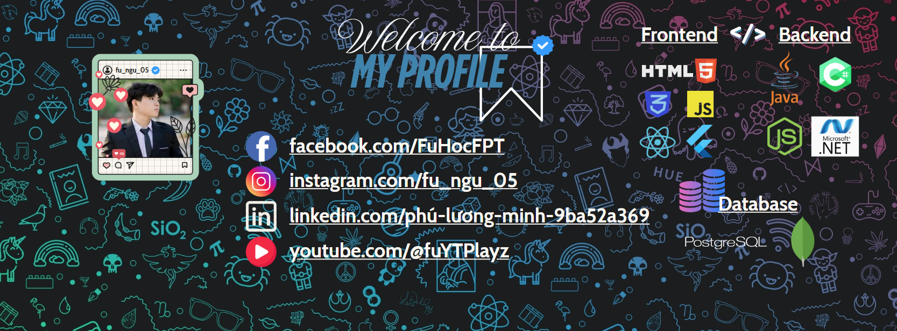

  

      
<!--      -->
      <h2 align="center"> こんにちは～👋 I'm Fu! Nice to meet you! ✨</h2>
      </a>
  

  ##  About me 
  <table style="width:100%; text-align:center;">
    <tr>
      <td style="width:50%;"></td>
      <td style="width:50%;">
        <h2>Luong Minh Phu</h2>
          
 A programmer, software architect. Likes reading manga, listening to music and playing games (Honkai: Star Rail, Valorant, Palworld, Counter Strike 2).

          <!-- 
 My current version: 20.8.
 -->
          
 My current version: <!--START_VERSION-->20.8<!--END_VERSION-->.

          
 Personality: I am He/Him/Potato.

      </td>
    </tr>
  </table>

  ##  Club Activities

<table style="width:100%; justify-content:center;">
  <tbody>
    <tr><td></td><td><h2>General Secretary at MiraiJC - FPT Japanese Club</h2></td><td>2024 - 2025</td></tr>
  </tbody>
  <tbody>
    <tr><td></td><td><h2>Blue belt at FDN FPT Nunchaku Club (2023-2024)</h2></td><td>2023 - 2024</td></tr>
  </tbody>
  <tbody>
    <tr><td></td><td><h2>Member at FU-DEVER - FPT Developer Club </h2></td><td>2024 - 2026</td></tr>
  </tbody>
</table>
  ##  Facts
  My favorite quote: "To be, or not to be, that is the question." — William Shakespeare

  ##  Experience 
  I have few experience in parts related to C#, Java, HTML, CSS,...  

 

 

 

  ##  Contact
  

    
    
    
  

  ##  Github summary
  

  <!-- 

  
  

 -->

  

  ##  Github Contributions
  <picture>
    <source media="(prefers-color-scheme: dark)" srcset="https://github.com/LuongFu/LuongFu/blob/output/github-contribution-grid-snake-dark.svg">
    <source media="(prefers-color-scheme: light)" srcset="https://github.com/LuongFu/LuongFu/blob/output/github-contribution-grid-snake.svg">
    
  </picture>

  ## MY BIGGEST PROJECT
  

      <a href="https://github.com/LuongFu">
      <a href="https://github.com/marketplace/actions/update-image-readme">
      <!--START_SECTION:update_image-->
  
  <!--END_SECTION:update_image-->
  

  ##
  `If you have any questions or simply want to talk about your day, I'm always ready to hear from you. I'm always here, waiting for you!🍀🍀🍀`
